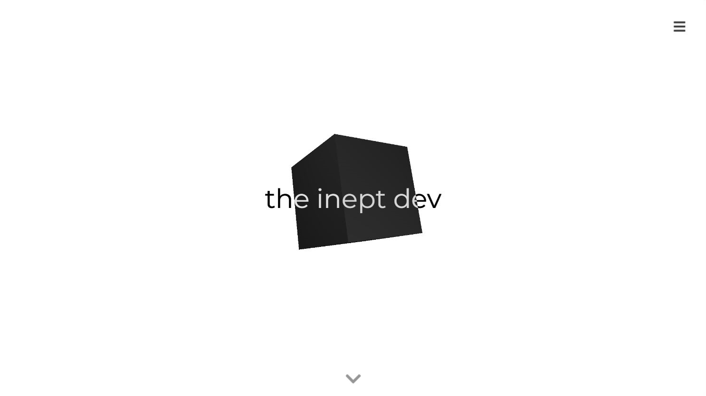
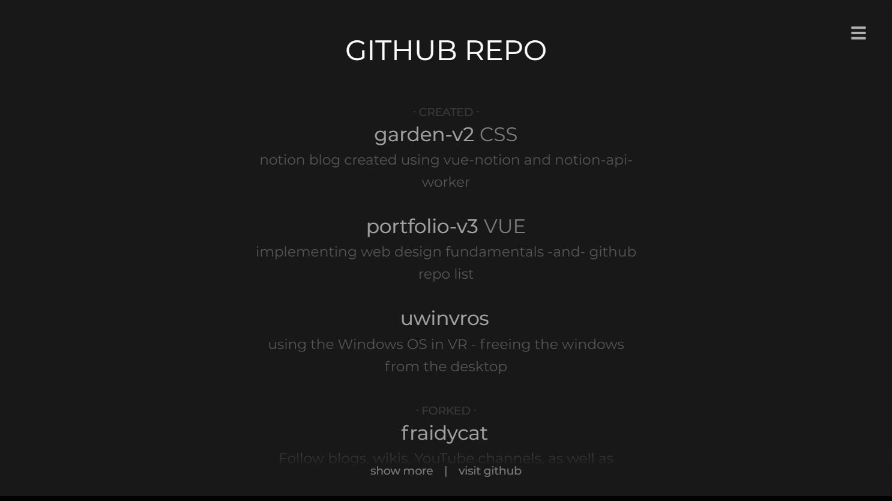

# [theinept.dev](http://theinept.dev)

The third iteration of [my personal website](http://theinept.dev).

Created to familiarize myself with Figma and to better implement web design fundamentals.

# Screenshots

  
  

# Technology

Planned with [Figma](https://www.figma.com/file/BJ8fg4jZY5PxrvU7xcQT5r/ineptSite) and developed using [Vue.js](https://vuejs.org/), [Three.js](https://threejs.org/), and George MacKerron's [github-widget](https://github.com/jawj/github-widget).
